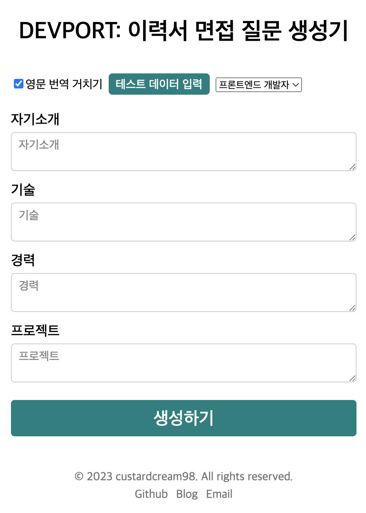

# DevPort

OpenAI API를 활용, 이력서를 입력하면 예상 면접 질문을 생성해주는 서비스입니다.

[사용해보기](https://dev-port-custardcream98.vercel.app/)

`테스트 데이터 입력`을 통해 간편하게 시연해볼 수 있습니다.

**❗THIS IS BETA❗**

---

## Flow

```md
1. 유저가 이력서를 입력한다.
2. Next.js의 API 서버로 내용을 전송한다.
3. Google Cloud Translate API를 활용해 영문으로 번역한다.
4. OpenAI API를 활용해 적절한 응답을 생성한다.
5. 다시 한국어로 번역한다.
6. API 서버로부터 응답을 받아 사용자에게 보여준다.
```

## ⚠️ 유의사항

- MVP 버전으로, 불안정할 수 있습니다.
  - `영문 번역 거치기` 옵션은 거의 항상 켜주셔야 합니다.
- 지나친 사용이 계속된다면 배포가 중지될 수 있습니다. (OpenAI API에서 제공하는 무료 크레딧의 한계로 인한 것으로, 양해 부탁드립니다 🥲) 조절을 위해 매 생성당 1분의 딜레이를 두었습니다.
- 더 빠르고 풍부한 응답을 위해 Google Cloud Translate API를 활용, 영문으로 번역 후 OpenAI API로 보내집니다. 이후 다시 응답을 한국어로 번역합니다. 따라서 내용이 일부 불확실할 수 있습니다.
- 이력서의 내용이 지나치게 길면 응답이 거절될 수 있습니다.

## About deployed API

- Next.js API route로 백엔드가 배포돼 있으나, Vercel Hobby Plan의 한계로 실제로는 Google Cloud Functions를 따로 배포해 사용하고 있습니다. (Next.js Proxy 활용)

## ToDos

- UX 개선
  - 이력서를 입력하는 방법, 전체 이력서의 길이 Limit 등을 쉽게 알 수 있도록 하는 방법 추가
- 응답의 퀄리티를 높이기 위한 fine tuning 필요
